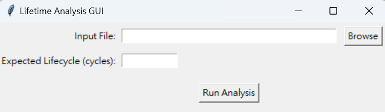

# Test2Fail-Toolkit

A comprehensive lifetime analysis system for reliability engineering and statistical analysis of failure data. This toolkit provides advanced statistical methods including Weibull distribution fitting, Monte Carlo simulation, and bootstrap analysis with professional PDF report generation.

## 🚀 Features

### Statistical Analysis
- **Multiple Distribution Fitting**: Weibull, Lognormal, and Exponential distributions
- **Maximum Likelihood Estimation**: Robust parameter estimation
- **Bootstrap Analysis**: Parameter uncertainty quantification with 1000 iterations
- **Monte Carlo Simulation**: 10,000 sample lifetime predictions
- **Goodness-of-Fit Testing**: Anderson-Darling and Kolmogorov-Smirnov tests

### Advanced Visualizations
- Histogram analysis of lifetime data
- PDF and survival function comparisons
- Hazard rate function analysis
- Weibull probability paper plots
- Bootstrap parameter distributions
- Monte Carlo prediction histograms

### Professional Reporting
- **Automated PDF Generation**: Comprehensive analysis reports
- **Statistical Validation**: Model adequacy testing
- **Maintenance Recommendations**: Cost-optimized maintenance strategies
- **Engineering Insights**: Reliability metrics and interpretations

## 📊 User Interface

### Main Application Interface


The intuitive GUI provides:
- **File Selection**: Support for CSV, TXT, and Excel files
- **Parameter Input**: Expected lifecycle specification
- **One-Click Analysis**: Automated statistical processing
- **Progress Tracking**: Real-time analysis status

### Automatic Report Generation


The system automatically generates professional PDF reports containing:
- Executive summary with key findings
- Detailed statistical analysis results
- Comprehensive visualizations with descriptions
- Engineering recommendations and maintenance strategies

## 📈 Analysis Outputs

### Distribution Comparison


Compare multiple probability distributions to identify the best-fit model:
- **Weibull Distribution**: Versatile model for various failure modes
- **Lognormal Distribution**: Suitable for multiplicative failure processes
- **Exponential Distribution**: Constant failure rate scenarios
- **Automatic Selection**: Best-fit determination via log-likelihood

### Survival Function Analysis


Reliability analysis through survival functions:
- **Survival Probability**: Time-dependent reliability curves
- **MTTF Visualization**: Mean Time To Failure indicators
- **Comparative Analysis**: Multiple distribution overlays
- **Engineering Metrics**: B10, B50, B95 life calculations

### Cumulative Distribution Functions


Statistical validation through CDF analysis:
- **Empirical vs Theoretical**: Model adequacy assessment
- **Kolmogorov-Smirnov Testing**: Statistical significance evaluation
- **Confidence Intervals**: Parameter uncertainty visualization
- **Model Validation**: Goodness-of-fit confirmation

## 🛠 Installation

### Prerequisites
```bash
Python 3.7+
```

### Required Dependencies
```bash
pip install numpy pandas matplotlib scipy statsmodels fpdf2 pillow tkinter
```

### Optional Dependencies
```bash
pip install openpyxl  # For Excel file support
```

## 🚀 Quick Start

### 1. Clone the Repository
```bash
git clone https://github.com/liu092111/Test2Fail-Toolkit.git
cd Test2Fail-Toolkit
```

### 2. Install Dependencies
```bash
pip install -r requirements.txt
```

### 3. Run the Application
```bash
python main.py
```

### 4. Load Your Data
- Click "Browse" to select your lifetime data file
- Supported formats: CSV, TXT, Excel (.xlsx)
- Enter expected lifecycle in cycles
- Click "Run Analysis"

## 📁 Project Structure

```
Test2Fail-Toolkit/
├── main.py                 # Main controller and application entry point
├── gui.py                  # User interface components
├── function_code.py        # Core statistical analysis functions
├── report_builder.py       # PDF report generation
├── dataset/               # Sample datasets
│   ├── dataset-1.csv
│   └── dataset-2.csv
├── img/                   # Documentation images
└── README.md              # This file
```

## 🔬 Technical Details

### Statistical Methods

#### Weibull Distribution
- **PDF**: `f(t) = (β/η) × (t/η)^(β-1) × exp(-(t/η)^β)`
- **Survival**: `S(t) = exp(-(t/η)^β)`
- **Hazard Rate**: `h(t) = (β/η) × (t/η)^(β-1)`

#### Parameter Interpretation
- **β (Shape Parameter)**:
  - β < 1: Decreasing failure rate (infant mortality)
  - β = 1: Constant failure rate (random failures)
  - β > 1: Increasing failure rate (wear-out)
- **η (Scale Parameter)**: Characteristic life (63.2% failure point)

### Bootstrap Analysis
1. Resample original data with replacement (1000 iterations)
2. Fit Weibull distribution to each bootstrap sample
3. Calculate 95% confidence intervals for parameters
4. Quantify parameter estimation uncertainty

### Monte Carlo Simulation
1. Generate 10,000 random samples from fitted Weibull distribution
2. Calculate reliability percentiles (B10, B50, B95)
3. Compute Mean Time To Failure (MTTF)
4. Provide robust lifetime predictions

## 📊 Sample Data

The toolkit includes sample datasets for testing:
- **dataset-1.csv**: Electronic component lifetime data
- **dataset-2.csv**: Mechanical system failure data

## 🔧 Advanced Usage

### Programmatic Access
```python
from function_code import LifetimeAnalyzer, LifetimeAnalyzerMC

# Load and analyze data
analyzer = LifetimeAnalyzer('your_data.csv')
analyzer.fit_distributions()

# Perform Monte Carlo analysis
mc_analyzer = LifetimeAnalyzerMC(analyzer.data)
bootstrap_result = mc_analyzer.print_bootstrap_weibull_params()
mc_result = mc_analyzer.print_monte_carlo_lifetime()

# Generate maintenance recommendations
maintenance = analyzer.calculate_maintenance_recommendations(
    target_reliability=0.9,
    cost_per_maintenance=1000,
    cost_per_failure=10000
)
```

### Custom Analysis Parameters
- **Bootstrap Iterations**: Adjustable from 100 to 10,000
- **Monte Carlo Samples**: Configurable simulation size
- **Confidence Levels**: Customizable confidence intervals
- **Maintenance Costs**: Flexible cost modeling

## 📈 Output Reports

### PDF Report Contents
1. **Executive Summary**: Key findings and statistical overview
2. **Data Analysis**: Distribution fitting and parameter estimation
3. **Bootstrap Results**: Parameter uncertainty analysis
4. **Monte Carlo Predictions**: Lifetime forecasting
5. **Statistical Validation**: Goodness-of-fit testing
6. **Maintenance Recommendations**: Cost-optimized strategies
7. **Engineering Insights**: Reliability metrics and interpretations

### Key Metrics Provided
- **B10 Life**: 10% failure point
- **B50 Life**: Median lifetime
- **B95 Life**: 95% failure point
- **MTTF**: Mean Time To Failure
- **Reliability at Target Cycles**: Probability of survival
- **Maintenance Intervals**: Optimal service schedules

## 🤝 Contributing

We welcome contributions! Please feel free to submit issues, feature requests, or pull requests.

### Development Setup
1. Fork the repository
2. Create a feature branch
3. Make your changes
4. Add tests if applicable
5. Submit a pull request

## 📄 License

This project is open source and available under the [MIT License](LICENSE).

## 🙏 Acknowledgments

- Built with Python scientific computing stack (NumPy, SciPy, Matplotlib)
- Statistical methods based on reliability engineering best practices
- GUI framework powered by Tkinter
- PDF generation using FPDF2

## 📞 Support

For questions, issues, or feature requests:
- Open an issue on GitHub
- Check the documentation in the code comments
- Review the sample datasets for usage examples

## 🔄 Version History

- **v1.0.0**: Initial release with core functionality
  - Weibull, Lognormal, and Exponential distribution fitting
  - Bootstrap and Monte Carlo analysis
  - Professional PDF report generation
  - Intuitive GUI interface
  - Sample datasets and documentation

---

**Test2Fail-Toolkit** - Transforming failure data into reliability insights through advanced statistical analysis.
